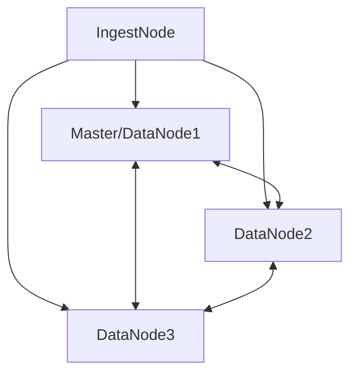

# Cluster sizing

## Node Type
1. **Master** Node: This is the node responsible for managing the cluster state, including creating or deleting indices, assigning shards to nodes, and maintaining a synchronized copy of the cluster state.
2. **Data Node**: This node holds the actual data of the indices and is responsible for performing data-related operations such as indexing, searching, and aggregations.
3. **Ingest Node**: This node is responsible for preprocessing documents before indexing, such as applying transformations, enriching data, or filtering unwanted content.
4. **Coordinating Node**: This node acts as a gateway or a load balancer for client requests, distributing the requests to the appropriate data nodes and aggregating the results.
5. **Tribe Node**: This node is used to connect to multiple clusters and search across them as if they were a single cluster.
6. **Client Node**: This node serves as a lightweight node that doesn't hold data, but it can perform search and indexing requests and distribute them to the appropriate data nodes.
7. **Machine Learning Node**: This node is used to perform machine learning tasks, such as anomaly detection, on the data stored in the cluster.

## Hardware size
1. CPU: Elasticsearch is CPU-intensive, so you should aim for a modern, high-core-count CPU. A minimum of 4 cores is recommended, but more is better. Ideally, you should have at least 8 cores or more for optimal performance.
2. Memory: Elasticsearch is also memory-intensive. You should allocate at least 50% of the available RAM to Elasticsearch heap space, which is used for caching and query execution. A minimum of 8 GB of RAM is recommended, but more is better, especially if you have a large dataset or a high query volume.
3. Storage: Elasticsearch stores its data on disk, so you'll need fast, reliable storage. SSDs are recommended for their fast read/write speeds, but spinning disks can also work if you have a tight budget. You should also aim for high disk throughput and low latency
4. Network: Elasticsearch is a distributed system that communicates over the network, so you should have a fast, reliable network connection between nodes. 10Gb Ethernet or higher is recommended.
5. Operating System: Elasticsearch runs on multiple operating systems, including Linux, Windows, and macOS. However, Linux is the most commonly used and recommended OS for Elasticsearch due to its stability and performance.


## In resume
4 Servers 8 CPU, 16 GB RAM, 1 TB SSD (except 1 with 256GB), 10 Gb Ethernet

- 1 Master node collocated on the same server of datanode
- 3 Data nodes
- 1 Ingest node (separate server)

This configuration is basic and can be scaled up as needed. The ingest node can be collocated on the same server of datanode if you don't have a lot of data to ingest. 




# Ingestion

## Filebeat
```yaml
filebeat.inputs:
- type: log
  enabled: true
  paths:
    - /path/to/xml/file.xml
  exclude_lines: ['^\\s*$']
  xml:
    # XPath expressions to extract data from the XML file
    # Use a unique name for each field
    xpath: 
      - name: "Title"
        xpath: "//Title/text()"
      - name: "Claims"
        xpath: "//Claims/P"  

output.elasticsearch:
  hosts: ["localhost:9200"]

```


## Custom program with REST API
You can use any programming language to ingest data into Elasticsearch. The only requirement is that the data must be in JSON format. The following example shows how to ingest data into Elasticsearch using Python.

```Python
import requests
import json

# Define the Elasticsearch endpoint
es_endpoint = "http://localhost:9200"

# Define the index name
index_name = "my_index"

# Define the document type
doc_type = "xml"


# Define the document body
doc_body = {
  "Title":"METAL OXIDE DISPERSION",
  "PublicationNumber":"EP1926468A1",
  "Inventor":[
    "KESSELL LORNA MARGARET [GB]",
    "NADEN BENJAMIN JOHN [GB]"
    ],
  "Applicant":[
    "CRODA INT PLC [GB]",
    "CRODA INTERNATIONAL PLC"
    ],
  "Abstract":"A dispersion contains particles of metal oxide having a median volume particle diameter in the range from 24 to 42 nm which are dispersed in a medium which includes a mixture of at least one polar material having an interfacial tension of less than 30 mNm and at least one siloxane fluid.",
  "Claims":[
    "CLAIMS",
    "1. A dispersion comprising particles of metal oxide having a median volume particle diameter in the range from 24 to 42 nm, dispersed in a medium which comprises a mixture of (i) at least one polar material having an interfacial tension of less than 30 mNm and (ii) at least one siloxane fluid.",
    "2. A dispersion according to claim 1 wherein the metal oxide particles have a mean crystal size in the range from 4 to 10 nm."
    ]
  }


# Define the endpoint for the index
index_endpoint = es_endpoint + "/" + index_name

# Define the endpoint for the document
doc_endpoint = index_endpoint + "/" + doc_type + "/" + str(doc_body['PublicationNumber'])

# Create the index
requests.put(index_endpoint)

# Index the document
requests.put(doc_endpoint, data=json.dumps(doc_body))

```

## Custom program with ES lib
```Python
from datetime import datetime
from elasticsearch import Elasticsearch

data = {
  "Title":"METAL OXIDE DISPERSION",
  "PublicationNumber":"EP1926468A1",
  "Inventor":[
    "KESSELL LORNA MARGARET [GB]",
    "NADEN BENJAMIN JOHN [GB]"
    ],
  "Applicant":[
    "CRODA INT PLC [GB]",
    "CRODA INTERNATIONAL PLC"
    ],
  "Abstract":"A dispersion contains particles of metal oxide having a median volume particle diameter in the range from 24 to 42 nm which are dispersed in a medium which includes a mixture of at least one polar material having an interfacial tension of less than 30 mNm and at least one siloxane fluid.",
  "Claims":[
    "CLAIMS",
    "1. A dispersion comprising particles of metal oxide having a median volume particle diameter in the range from 24 to 42 nm, dispersed in a medium which comprises a mixture of (i) at least one polar material having an interfacial tension of less than 30 mNm and (ii) at least one siloxane fluid.",
    "2. A dispersion according to claim 1 wherein the metal oxide particles have a mean crystal size in the range from 4 to 10 nm."
    ]
  }
es = Elasticsearch(es_endpoint, basic_auth=basics)

resp  = es.index(index="patents", id=data['PublicationNumber'], document=data)
print(resp['result'])


```

# Get Data from Elasticsearch

Reference for https://www.elastic.co/guide/en/elasticsearch/reference/current/paginate-search-results.html

``` bash
curl -XGET 'http://localhost:9200/patents/_search' -d '{
  "query": {
    "match": {
      "PublicationNumber": "EP1926468A1"
    }
  }
}'
```

## Get data with ES lib
```Python
from elasticsearch import Elasticsearch

# create an Elasticsearch client instance
es = Elasticsearch(['http://localhost:9200'])

# define the Elasticsearch query
# return document with british inventor
query = {
    "query": {
      "match_phrase": {
        "Inventor": "[GB]"
      }
    },
    "fields": [
        "PublicationNumber",
        "Title",
        "Inventor"
      ],
    "_source": false
}

# execute the Elasticsearch query
result = es.search(index='patents', body=query)

# loop through the hits and print the product names
for hit in result['hits']['hits']:
    print(hit['_source']['name'])


```


# Data Mapping
```json
{
  "mappings": {
    "properties": {
      "Abstract": {
        "type": "text", # text type is used for full-text search. data type OKAY
        "fields": {
          "keyword": {
            "type": "keyword",
            "ignore_above": 256
          }
        }
      },
      "Applicant": {
        "type": "text",  # text type is used for full-text search. data type OKAY
        "fields": {
          "keyword": {
            "type": "keyword",
            "ignore_above": 256
          }
        }
      },
      "ApplicationDate": {
        "type": "date"
      },
      "ApplicationNumber": {
        "type": "text", # Should be keyword
        "fields": {
          "keyword": {
            "type": "keyword",
            "ignore_above": 256
          }
        }
      },
      "Claims": {
        "type": "text", # text type is used for full-text search. data type OKAY
        "fields": {
          "keyword": {
            "type": "keyword",
            "ignore_above": 256
          }
        }
      },
      "IPC": {
        "type": "text", # text type is used for full-text search. data type OKAY
        "fields": {
          "keyword": {
            "type": "keyword",
            "ignore_above": 256
          }
        }
      },
      "Inventor": {
        "type": "text", # text type is used for full-text search. data type OKAY
        "fields": {
          "keyword": {
            "type": "keyword",
            "ignore_above": 256
          }
        }
      },
      "NCL": {
        "type": "text", # text type is used for full-text search. data type OKAY
        "fields": {
          "keyword": {
            "type": "keyword",
            "ignore_above": 256
          }
        }
      },
      "PriorityDate": {
        "type": "date"
      },
      "PriorityNumber": {
        "type": "text",  # Should be keyword
        "fields": {
          "keyword": {
            "type": "keyword",
            "ignore_above": 256
          }
        }
      },
      "PublicationNumber": {
        "type": "text",  # Should be keyword
        "fields": {
          "keyword": {
            "type": "keyword",
            "ignore_above": 256
          }
        }
      },
      "RequestedPatent": {
        "type": "text",  # Should be keyword
        "fields": {
          "keyword": {
            "type": "keyword",
            "ignore_above": 256
          }
        }
      },
      "SubDatabase": {
        "type": "text",  # Should be keyword
        "fields": {
          "keyword": {
            "type": "keyword",
            "ignore_above": 256
          }
        }
      },
      "Title": {
        "type": "text",  # Datatype OKAY
        "fields": {
          "keyword": {
            "type": "keyword",
            "ignore_above": 256
          }
        }
      }
    }
  }
}
```